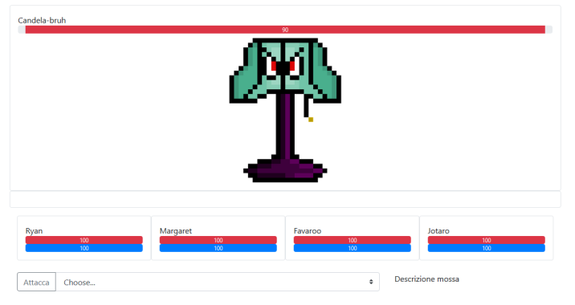

# RPG
Gioco RPG a turni per il progetto di TPSIT

## Documentazione
>[Docs](https://github.com/DenisFerrero/RPG/tree/master/docs)

La documentazione presenta
* Diagramma UML delle classi utilizzate
* Bozza dell'interfaccia del progetto
* Interfaccia finale

## Scopo del gioco
L'obbiettivo del gioco è quello di usare i 4 personaggi a disposizione per sconfiggere il boss

## How to play
Dopo aver eseguito l'accesso alla pagina di Home premendo sul pulsante *inizia a giocare* si verrà reindirizzati alla pagina di gioco. L'interfaccia è simile a questa: 
L'utente avrà a disposizione **4 personaggi**, per decidere con quale attaccare e con quale mossa, bisogna selezionare il personaggio cliccandoci sopra ai suoi parametri descrittivi (la vita o il mana). Da quel momento sarà possibile selezionare la mossa nella scelta multipla poco più sotto e con il pulsante *attacca* permette di far danno al nemico o di curarsi. Ogni 2 volte che l'utente avrà attaccato con i suoi personaggi, il Boss farà la sua mossa causando danno a uno dei tuoi alleati.

## Bug
Le ultime versioni dei browser hanno disattivato di default gli autoplay degli audio e dei video quindi per poter ascoltare anche l'audio di sottofondo durante il combattimento e nella pagina home bisognerà attivare in alto a sinistra, vicino alla *barra di navigazione*, i permessi per l'audio. Dopo questa operazione ricaricare la pagina per rendere effettive le modifiche.

## Credits
* [@Elom23](https://github.com/Elom23)
* [@TanjaPrini](https://github.com/TanjaPrini)
* [@ANDY2099x](https://github.com/ANDY2099x)
* [@DenisFerrero](https://github.com/DenisFerrero)